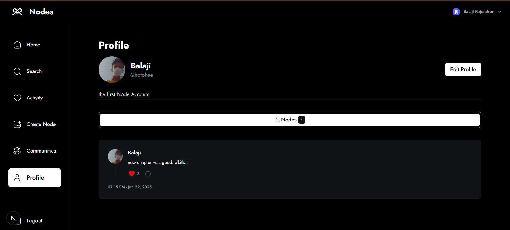

<div style="display:flex;">
<div>
 
</div>
<div>

# Nodes – Collaborative Content Platform
</div>

</div>

Nodes is a modern web application built with **Next.js**, **TypeScript**, **Tailwind CSS**, and **Clerk** for authentication. It allows users to create, collaborate, and share content seamlessly through a sleek UI and real-time features. The project is designed with modularity and scalability in mind, backed by MongoDB and enhanced with UploadThing, **shadcn/ui**.

---

## ✨ Features

* 🔐 **User Authentication** using Clerk
* 🧱 **Component-based Architecture** with Radix UI, **shadcn/ui**, and Lucide icons
* 📦 **Upload Handling** via UploadThing
* 🧮 **Form Validation** using Zod + React Hook Form
* 🌐 **MongoDB Integration** through Mongoose
* ⚡ **Next.js Middleware** for route management
* 💅 **Modern UI/UX** with Tailwind CSS and dark mode support
* 🚀 **High Performance** using Next.js Turbopack

---

## 📁 Project Structure

```
Nodes/
├── components/           # UI and functional components
├── pages/                # Next.js pages
├── public/               # Static assets
├── styles/               # Global styles
├── middleware.ts         # Middleware logic
├── next.config.ts        # Next.js config
├── package.json          # Project metadata and dependencies
├── tsconfig.json         # TypeScript config
└── README.md             # Project documentation
```

---

## 🧑‍💻 Getting Started

Follow these steps to set up the project locally:

### Prerequisites

* Node.js (v18+ recommended)
* npm or yarn
* MongoDB instance (local or cloud)
* Clerk account for authentication
* (Optional) UploadThing & environment config

### Installation

1. **Clone the repository**

```bash
git clone https://github.com/yourusername/nodes.git
cd nodes
```

2. **Install dependencies**

```bash
npm i
```

3. **Set up environment variables**

Create a `.env.local` file and add the following:

```env
NEXT_PUBLIC_CLERK_PUBLISHABLE_KEY=your_clerk_publishable_key
CLERK_SECRET_KEY=your_clerk_secret_key
MONGODB_URI=your_mongo_connection_string
UPLOADTHING_SECRET=your_uploadthing_secret
UPLOADTHING_APP_ID=your_uploadthing_app_id
```

4. **Run the development server**

```bash
npm run dev
```

Open [http://localhost:3000](http://localhost:3000) in your browser.

---

## 🧰 Tech Stack

| Tool               | Purpose               |
| ------------------ | --------------------- |
| Next.js            | Framework             |
| TypeScript         | Static typing         |
| Tailwind CSS       | Styling               |
| Clerk              | Authentication        |
| MongoDB + Mongoose | Database              |
| UploadThing        | File Uploading        |
| Zod                | Schema validation     |
| React Hook Form    | Form management       |
| Lucide React       | Icon library          |
| Radix UI           | Accessible components |
| **shadcn/ui**      | UI component library  |

---

## 📜 Available Scripts

```bash
npm run dev       # Runs the app in development mode
npm run build     # Builds the app for production
npm run start     # Starts the production build
npm run lint      # Runs ESLint for code quality
```

---

## 🧪 Linting & Formatting

This project uses `eslint-config-next` and `prettier`:

```bash
npm run lint
```

You can customize lint rules in `.eslintrc` and format settings in `.prettierrc`.

---

## 📸 Screenshots

##### Sign In page


##### Sign Up page


##### Onboarding page


##### Home page


##### Search Users page


##### Activity page


##### Create Node page


##### Node page


##### Communities page


##### Profile page


##### Edit Profile page


---

## 🙌 Contributing

We welcome contributions! To contribute:

1. Fork the repo
2. Create a new branch (`git checkout -b feature/my-feature`)
3. Commit your changes
4. Push to the branch (`git push origin feature/my-feature`)
5. Open a pull request

---

## 🔗 Links

* [Next.js Docs](https://nextjs.org/docs)
* [Clerk Docs](https://clerk.com/docs)
* [UploadThing](https://uploadthing.com/)
* [Tailwind CSS](https://tailwindcss.com/)
* [MongoDB](https://www.mongodb.com/)
* [shadcn/ui](https://ui.shadcn.com/)

---

Let me know if you want a `.env.example`, badge shields, or custom sections like **"Known Issues"** or **"Roadmap"**!
